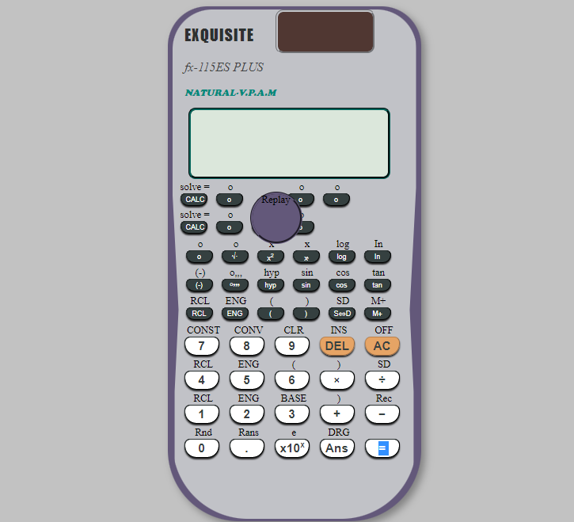

## Table of contents

- [Overview](#overview)
  - [The challenge](#the-challenge)
  - [Screenshot](#screenshot)
  - [Links](#links)
- [My process](#my-process)
  - [Built with](#built-with)
  - [What I learned](#what-i-learned)
  - [Continued development](#continued-development)
  - [Useful resources](#useful-resources)
- [Author](#author)
- [Acknowledgments](#acknowledgments)
## Overview
A web-based scientific casio calculator designed for both basic usage and scientific calculation.
### The challenge

Users should be able to:

- Do simple arithmetic calculation
- Do complex calculation like finding the sin,cos, tan of an angle. finding the square root of numbers and all

### Screenshot

### Links

- Solution URL: [Add solution URL here](https://github.com/hebrohim/scientificCasioCalculator)
- Live Site URL: [Add live site URL here](https://ibscientificcalc.netlify.app)

## My process

### Built with

- Semantic HTML5 markup
- CSS custom properties
- CSS clip path
- Mobile-first workflow
- javascript math functions
- javascript DOM
### What I learned

- I learnt how to use javascript math function like math.random,math.ceil,math.floor,math.sqrt etc.
- I also learnt  how to use CSS clipath to create any shape . i used the clippath to design the shape of the calculator

### Continued development
i still need to work more on the responsiveness

### Useful resources

- [Example resource 1](https://www.w3schools.com/js/js_math.asp) - This helped me to understand math function very well
 
## Author

- Website -(https://github.com/hebrohim/scientificCasioCalculator)

## Acknowledgments
stackOverflow.com
google.com